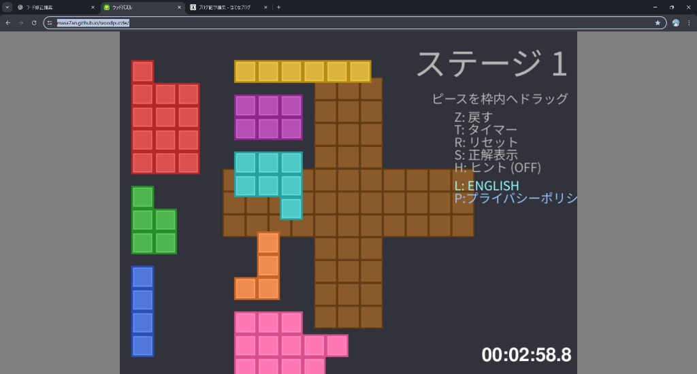

# Wood Puzzle

シルエットにピースをはめ込むパズルゲーム  
A puzzle game where you fit pieces into silhouettes

## 🎮 Play

[▶ Play Now](https://masa7an.github.io/woodpuzzle/)

## 📷 Screenshot

## 📖 How to Play

- **ドラッグ**: ピースを枠内に配置  
  Drag: Place pieces in the frame
  
- **Z**: 元に戻す (Undo)  
   Undo
  
- **R**: リセット  
   Reset
  
- **T**: タイマー表示切替  
   Toggle timer display
  
- **H**: ヒント表示  
   Show hint
  
- **L**: 言語切替 (日本語/English)  
   Switch language (Japanese/English)
  
- **P**: プライバシーポリシー  
   Privacy policy

## 🏆 Features

- 20 ステージ  
  20 stages
  
- RTAタイマー & ランキング  
  RTA timer & ranking
  
- 日本語/英語対応  
  Japanese/English support
  
- ブラウザで動作（PC/スマホでも一応動く）  
  Works in browser (PC/mobile)

## 🛠 Tech Stack

- Python + Pygame
- Pygbag (WebAssembly)
- Google Analytics 4

## 📄 License

MIT License

## 🔒 Privacy

[Privacy Policy](./privacy.html)

---

## 📝 Update History

### 2025-12-19

- FPS improvement. 改善アップデート（パフォーマンス最適化、視覚フィードバック追加）

